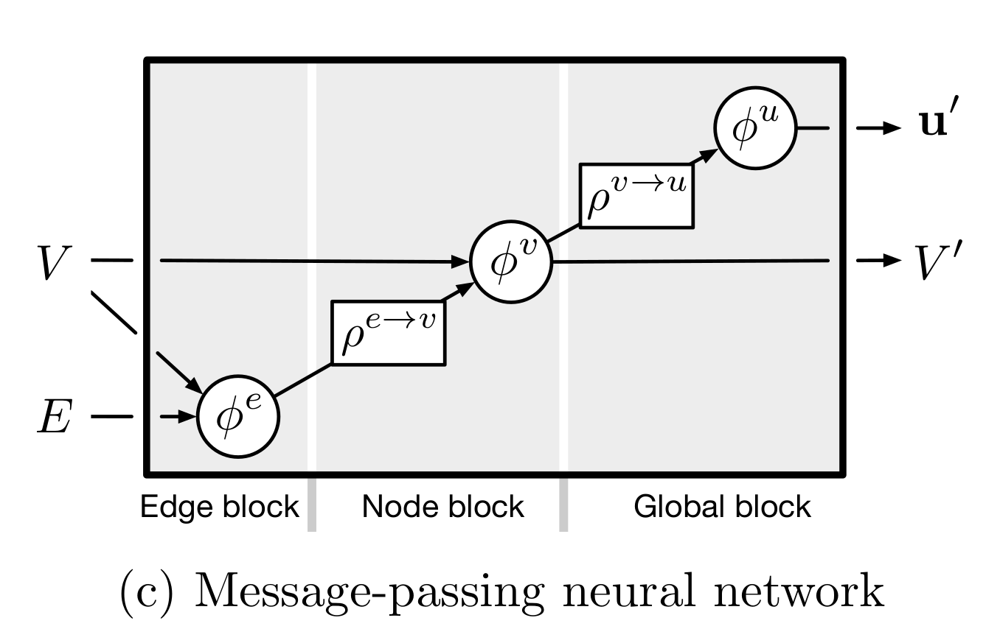

# TMVA-Test

This is a test task for a GSoC TMVA project, where a message-passing GNN is implemented. Later, the message-passing-based architecture is tested on classification of function of molecular compounds.


### Prerequisites

* [Eigen](http://eigen.tuxfamily.org/index.php?title=Main_Page)
* [nlohmann/json](https://github.com/nlohmann/json)
* [Pytorch](https://pytorch.org/get-started/locally/)
* [Monoamine Oxydase (MAO) dataset unpacked in a directory /MAO of this repository](https://brunl01.users.greyc.fr/CHEMISTRY/)


 You can find the main massage passing module implemented in PyTorch (constructed according to the paper by [Battaglia et al. (2018)](https://arxiv.org/abs/1806.01261)) in models.py

### Structure of the repository

* ```models.py``` - implements the main message-passing neural block.
* ```src/main.cpp``` - contains the implementation of the forward pass of the message-passing block in C++ without any additional DL frameworks. The main function also performs the testing of the forward pass.
* ```test.py``` - contains the comparative testing of a message-passing neural block.
* ```weights.json``` - contains the weights for a MPNN to be tested both in C++ and PyTorch.
* ```test_graph.json``` - contains the description of the graph, on which the block should be tested. It is a dictionary of three elements: 
    * E - an array of edge attributes.
    * V_E - an array of pairs. Each pair describes a source and the destination vertice of a graph edge.
    * V - an array of vertice attributes.
* ```train_and_eval.py``` - a script with the main experiment: training a model from 3 consecutive MPNN blocks on a MOA dataset
* ```mao.py``` - contains the utility functions for loading the dataset.


## Introduction

Message-passing NNs are a subtype of graph networks, initially described by [Gilmer et al. (2017)](https://arxiv.org/pdf/1704.01212) for the tasks of quantum chemistry. They are characterized by the fact that only vertice states change and propagate between blocks (i.e. across time). Each block takes as input vertice attributes and constant edge attributes. After each step they produce modified vertice attributes and a global attribute vector (or "readout").


picture source: [Battaglia et al. (2018)](https://arxiv.org/abs/1806.01261))

## Block structure

Since the task required our architecture to be able to produce graph-level outputs, edge-level output and node-level output, we add the corresponding outputs to the architecture of the block. Nevertheless, it is necessary to remid, that in the canonical message-passing NN, only the vertices pass information to the next blocks. The demonstration of the graph-level, edge-level and node-level outputs can be later seen in the comparison of the C++ and PyTorch models.

## Evaluation on a dataset

Monoamine Oxydase (MAO) dataset contains 68 molecules that may either inhibit the action of an antidepressant drug monoamine oxidase, or not influence it. The dataset is fairly short and reasonably balanced: 38 positives and 30 negatives.

Our implementation from 3 MPNN-block neural network achieve the accuracy of 0.92, which is reasonably close to the state-of-the-art (0.96) and demonstrates the promissing nature of the architecture.

## C++ implementation

As was requested, the message passing neural block was implemented in C++ and the implementation is compared to the PyTorch one. Both implementation give similar resuts with the difference of the outputs less than 10E-4 on average, which can be explained by numerical instability. 

For the provided test graph and weights, the output of both versions should be
```
Edge attributes: 
 -0.203453  -0.204412   0.472612
 -0.155813  -0.273696   0.358202
 -0.134219  -0.309109   0.297982
 -0.230367  -0.155213   0.575498
 -0.269875  -0.203439   0.527423
  -0.31211 -0.0893437   0.683901
  -0.33622  -0.104172   0.673099
  -0.26615  -0.194666   0.520618
 -0.166922   -0.28809   0.337972
  -0.22894  -0.235037    0.45973
Vertice attributes: 
-0.264677   0.46884 -0.537437
 -0.35031  0.509448 -0.692974
-0.232552  0.619185  -0.70247
-0.322939  0.578654 -0.781288
-0.313333  0.499292 -0.586383
 -0.22661   0.58536 -0.627947
-0.280642  0.547321 -0.695535
-0.151487  0.627981 -0.611354
-0.277096   0.60107 -0.747298
-0.438197  0.467382 -0.734908
Global attributes: 
-0.773157
 0.613589
 0.614877
```